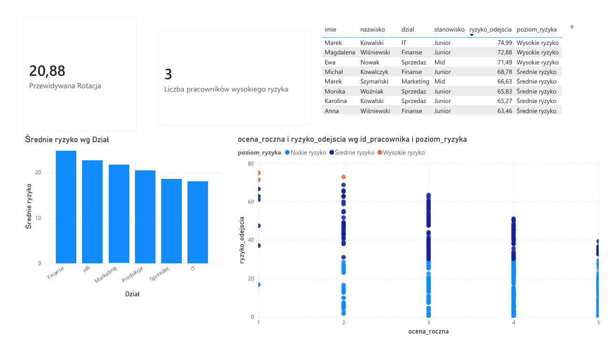

# IntelligentHR-BI - System Predykcji Rotacji Pracowników i Analityki HR

Projekt typu End-to-End realizujący system analityczny (People Analytics) oparty na uczeniu maszynowym. System pobiera dane pracownicze z bazy danych, wykorzystuje model AI do prognozowania ryzyka odejścia pracowników (Employee Churn) i wizualizuje wyniki w interaktywnym dashboardzie Power BI.

## Struktura projektu

* `docker-compose.yml` - Konfiguracja kontenera z bazą PostgreSQL.
* `tworzenie_tabel.sql` i `widoki.sql` - Skrypty SQL tworzące struktury tabel operacyjnych (OLTP) oraz widoki analityczne.
* `requirements.txt` - Lista bibliotek Pythona wymaganych do uruchomienia projektu.
* `generator_danych.py` - Skrypt w Pythonie generujący 1000 realistycznych rekordów pracowników z zaszytymi regułami biznesowymi.
* `analytics_engine.py` - Silnik AI w Pythonie (Scikit-Learn), który trenuje model uczenia maszynowego i zapisuje prognozy prawdopodobieństwa odejścia do bazy danych.
* `raport.pbit` / `raport.pdf` - Szablon raportu Power BI oraz jego eksport do formatu PDF.
* `1.png` - Wygenerowany zrzut ekranu przedstawiający gotowy raport z Power BI.

---

## Szybkie uruchomienie

1.  **Uruchomienie bazy w tle (Docker):**
    ```bash
    docker-compose up -d
    ```
2.  **Instalacja wymaganych bibliotek Pythona:**
    ```bash
    pip install -r requirements.txt
    ```
3.  **Inicjalizacja tabel w PostgreSQL:**
    Uruchom kod ze skryptów SQL (tworzenie_tabel.sql oraz widoki.sql) w swojej bazie hr_db, aby przygotować strukturę bazy.
4.  **Generowanie danych źródłowych:**
    ```bash
    python generator_danych.py
    ```
5.  **Uruchomienie silnika ML i predykcji AI:**
    ```bash
    python analytics_engine.py
    ```

Po wykonaniu tych kroków baza zostanie zasilona wynikami predykcji, z którymi bezpośrednio łączy się raport Power BI.

---

## Dashboard Analityczny HR (Power BI)

Raport został zaprojektowany z myślą o kadrze zarządzającej i dyrektorach HR w celu szybkiej identyfikacji zagrożeń kadrowych w organizacji oraz ochrony kluczowych talentów.



### Główne elementy i metryki dashboardu:
* **Ogólny status kadrowy:** Prezentacja kluczowych wskaźników (KPI), takich jak Przewidywana Rotacja w ujęciu procentowym oraz Liczba pracowników wysokiego ryzyka wymagających natychmiastowej uwagi.
* **Tabela Zagrożonych Pracowników:** Szczegółowa lista osób o najwyższym prawdopodobieństwie odejścia, pozwalająca managerom na szybki wgląd w sytuację konkretnych zespołów.
* **Analiza Ryzyka wg Działów:** Wykres słupkowy pozwalający natychmiast zlokalizować jednostki organizacyjne o najwyższym średnim stopniu zagrożenia rotacją (np. Finanse, HR).
* **Macierz Oceny do Ryzyka Odejścia:** Wykres punktowy (Scatter Plot) mapujący pracowników pod kątem ich efektywności (ocena roczna w skali 1-5) oraz ryzyka odejścia wyliczonego przez AI. Pozwala to na wyodrębnienie tzw. Kluczowych Talentów do uratowania (osób o wysokich ocenach i wysokim ryzyku odejścia, widocznych w prawym górnym rogu wykresu).
* **Segmentacja Ryzyka:** Podział pracowników na czytelne biznesowo koszyki (Niskie, Średnie, Wysokie ryzyko) wyróżnione kolorystycznie na wykresie punktowym.
